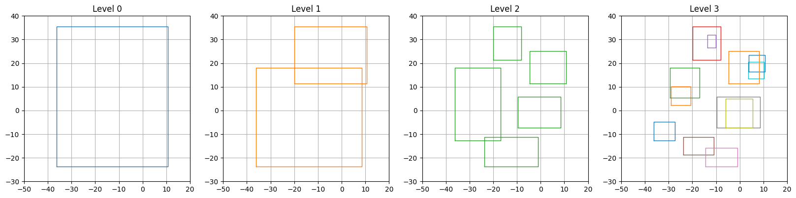

# Problem

## Problem statement

> Eliminate overlapped convex hulls
>
> - Load convex_hulls.json.
> - Some of the convex hulls stored in convex_hulls.json are overlapped.
> - Eliminate the overlapped convex hulls based on the following rule.
>   - Eliminate the convex hull if it has more than 50% of its own area overlapped with another convex hull (pairwise area overlap).
> - Generate result_convex_hulls.json which stores only the remaining (non-eliminated) convex hulls. The format should be the same as convex_hulls.json.
> - Authorized program language is only C++.
>   - Follow a coding style guide which you are using.
>     - E.g. Google C++ Style Guide
>   - Mention the style guide as a comment on the top of your program code.
>     - // This code follows Google C++ Style Guide.
> - You are allowed to use JSON library to read/write a json file.
>   - E.g. https://nlohmann.github.io/json/.
> - You are allowed to use the std library in C++.
> - Do not use any other libraries, especially to calculate area or intersection.
> - Put appropriate comments for the reviewer to understand your code easily.
> - Submit the following files:
>   - your code and the code for the json library you used
>   - your result_convex_hulls.json
>   - Instruction to build and run your code so that we can reproduce your result using your submission

## Reformulation of the problem statement for clarity

### Task

Eliminate overlapped convex hulls

- Load convex_hulls.json.
- Some of the convex hulls stored in convex_hulls.json are overlapped.
- Eliminate the overlapped convex hulls based on the following rule.
  - Eliminate the convex hull if it has more than 50% of its own area overlapped with another convex hull (pairwise area overlap).
- Generate result_convex_hulls.json which stores only the remaining (non-eliminated) convex hulls.

### Constraints

- The format should be the same as convex_hulls.json.
- Authorized program language is only C++.
  - Follow a coding style guide which you are using.
    - E.g. Google C++ Style Guide
  - Mention the style guide as a comment on the top of your program code.
    - // This code follows Google C++ Style Guide.
- You are allowed to use JSON library to read/write a json file.
  - E.g. https://nlohmann.github.io/json/.
- You are allowed to use the std library in C++.
- Do not use any other libraries, especially to calculate area or intersection.
- Put appropriate comments for the reviewer to understand your code easily.

### Submission

- Submit the following files:
  - your code and the code for the json library you used
  - your result_convex_hulls.json
  - Instruction to build and run your code so that we can reproduce your result using your submission

# Important point

All the code in this jupyter notebook is purely for visualization and debugging  
The algorithm itself have been completly implemented in C++  
The python bindings only

- convert the python data
- feed the data to the C++ code that perform the algorithm
- convert the data to python

If this is a problem, please feel free to delete the following folder/files

- _python/convex_hull_filtering.cpp_ (Wrapper code written in c++)
- _setup.py_ (Configuration to build the wrapper code)
- _test.py_ (Test file to test the bindings)
- _problem_analysis.ipynb_ (this jupyter notebook)

The C++ code should still compile without any issue

Also I used _googletest_ library to perform unit test on the code  
again, if this is an issue please feel free to delete the following folder/files

- _test/BoundingBox_test.cpp_
- _test/ConvexHull_test.cpp_
- _test/Edge_test.cpp_
- _test/main.cpp_

and replace the _CMakeLists.txt_ file with the following content:

```cmake
cmake_minimum_required(VERSION 3.15)
set(CMAKE_CXX_STANDARD 17)

include(FetchContent)

FetchContent_Declare(
  json
  URL https://github.com/nlohmann/json/releases/download/v3.11.2/json.tar.xz)
FetchContent_MakeAvailable(json)

project(ConvexHullFiltering)

file(GLOB_RECURSE sources src/convex_hull_filtering/*.cpp)
add_executable(convex_hull_filtering src/main.cpp ${sources})
target_include_directories(convex_hull_filtering PUBLIC include)
target_link_libraries(convex_hull_filtering PRIVATE nlohmann_json::nlohmann_json)
target_compile_options(convex_hull_filtering PRIVATE -Wall -Wextra -Wpedantic -Werror)
```

# Instruction to build and run the code

## Preparation of the build environment

Open a terminal and execute the following commands:

```
sudo apt install build-essential cmake
```

## How to build the code

In the following, I will refer to the _root folder of this project_ as the folder that contains the _README.md_ file

### Building of the C++ code

In the _root folder of this project_, open a terminal  
And execute the following commands

```
mkdir build
cd build
cmake ..
make
```

### Building of the Python bindings (Optional)

In the _root folder of this project_, open a terminal  
And execute the following commands

```
python setup.py build_ext --inplace
```

## How to run the code

After the code has been successfully build

### Main executable

To run the main executable, open a terminal in the _root folder of this project_  
and execute the following commands:

```
./build/convex_hull_filtering
```

### Test executable (Unit test using googletest) / Optional

To run the test executable, open a terminal in the _root folder of this project_  
and execute the following command:

```
./build/convex_hull_filtering_test
```

**OR** the following commands:

```
cd build
ctest
```

### Other analysis scripts (Optional)

Install jupyter lab using the following command:

```
pip install jupyterlab
```

Start jupyter lab using the following command:

```
jupyter lab
```

Navigate to the _root folder of this project_ and open the file _problem_analysis.ipynb_  
You can also open this file directly from Microsoft Visual Studio Code

# Regarding coding style guide

I have setup my vscode with the following settings:

```
"C_Cpp.clang_format_style": "Google"
```

And run cpplint with the following commands:

```
cpplint --recursive .
```

# Part 1 : Problem analysis

## Initial analysis (Visualization of the problem)

```python
import json
import matplotlib.pyplot as plt
import matplotlib.colors as mcolors
import numpy as np
import math
from collections import namedtuple
from inspect import signature

# Increase the size of Jupyter plots
plt.rcParams['figure.figsize'] = [20, 10]

json_filepath = "./convex_hulls.json"

def set_axis():
    plt.xlim([-50, 20])
    plt.ylim([-30, 40])

def get_color(idx):
    color_palette = [color for color in mcolors.TABLEAU_COLORS]
    return color_palette[idx % len(color_palette)]

def plot_convex_hull(convex_hull, *args, **kwargs):
    points = convex_hull["points"]
    if 'color' not in kwargs:
        kwargs["color"] = get_color(convex_hull["ID"])
    plt.plot(np.append(points[:,0], [[points[0, 0]]], axis=0), \
        np.append(points[:,1], [[points[0,1]]], axis=0), *args, **kwargs)
    plt.text(points[0, 0], points[0, 1], convex_hull["ID"])

def load_json(filepath):
    with open(filepath) as f:
        data = json.load(f)

    convex_hulls = []
    for convex_hull in data["convex hulls"]:
        points = []
        for apex in convex_hull["apexes"]:
            points.append([apex['x'], apex['y']])
        convex_hulls.append({"ID": convex_hull["ID"], "points" : np.matrix(points)})
    return convex_hulls

convex_hulls = load_json(json_filepath)

for convex_hull in convex_hulls:
    plot_convex_hull(convex_hull)

plt.axis("square")
set_axis()
plt.grid()
plt.title("Initial data (convex_hulls.json)")
```

    Text(0.5, 1.0, 'Initial data (convex_hulls.json)')


# Part 2 : Intersection of convex hulls

## Research of algorithms

After a quick research on intersection of convex polygon, I fould the following:  
https://tildesites.bowdoin.edu/~ltoma/teaching/cs3250-CompGeom/spring17/Lectures/cg-convexintersection.pdf

This document seems to refer to the algorithm described in the following paper:  
https://www.cs.jhu.edu/~misha/Spring16/ORourke82.pdf

The algorithm is described as simple to implement and run in linear time.  
So I decided to proceed with this algorithm.

## Algorithm (extract from ORourke82)

The algorithm is describe in pseudo-code as follows:

> input: $P$ and $Q$  
> output: $P \cap Q$

> **begin** {main}  
> Choose $\mathbf{p}$ and $\mathbf{q}$ arbitrarily.  
> **repeat**

> > {Check to see if $\mathbf{\dot{p}}$ and $\mathbf{\dot{q}}$ intersect}  
> > **if** $\mathbf{\dot{p}}$ and $\mathbf{\dot{q}}$ intersect **then**

> > > **if** this intersection is the same as the first intersection **then** halt  
> > > **else** output the point of intersection and

> > > > {set inside} **if** $\mathbf{p} \in hp(\mathbf{\dot{q}})$ **then** $inside \leftarrow “P”$ else $inside \leftarrow “Q“$;

> > > {Advance either $\mathbf{p}$ or $\mathbf{q}$.}  
> > > **if** $\mathbf{\dot{q}} \times \mathbf{\dot{p}} \geq O$ **then**

> > > > **if** $\mathbf{p} \in hp(\mathbf{\dot{q}})$ **then** (advance $\mathbf{q}$) **else** (advance $\mathbf{p}$)

> > > **else** {$\mathbf{\dot{q}} \times \mathbf{\dot{p}} \lt 0$}

> > > > **if** $\mathbf{q} \in hp(\mathbf{\dot{p}})$ **then** (advance $\mathbf{p}$) **else** (advance $\mathbf{q}$);

> **until** repeat has executed more than $2(\lvert P \rvert + \lvert Q \rvert)$ times;  
> {either $P \cap Q = \emptyset$ or $P \supseteq Q$ or $P \subseteq Q$}  
> Choose $\mathbf{p}$ and $\mathbf{q}$ arbitrarily.  
> **if** $\mathbf{p} \in Q$ **then** output $P$ **else** **if** $\mathbf{q} \in P$ **then** output $Q$ **else** output $\emptyset$ ;  
> **end** {main}

> advance $\mathbf{p}$:

> > output $\mathbf{p}$ **if** $inside = “P“$;  
> > $p \leftarrow P_+$;

> advance $\mathbf{q}$:

> > output $\mathbf{q}$ **if** $inside =“Q”$;  
> > $q \leftarrow q_+$;

> $hp(\mathbf{\dot{p}}) = \{\mathbf{x} : \mathbf{\dot{p}} \times (\mathbf{x} - \mathbf{p_-}) \geq 0\}$

After implementing the algorithm in C++, I wrote python bindings to the C++ code.  
Python bindings doesn't affect the original code.  
They are just wrapper code that call the actual C++ code.  
The reason I wrote python bindings is so that I could visualize my results using this jupyter notebook.

## Explanations

An important point for this algorithm to work properly is that the convex hull should be left on the left side when iterating over the edges  
I ensured this by checking on which side the convex hull reside and then setting a direction value as follow:

- -1 : Iterate backward
- +1 : Iterate forward

Extract of paper

> ... so that the inside of the polygon is always to the left ...

Extract of code

```C++
  // The direction of scanning the edges should leave the convex hull on it left
  int Pdirection =
      Edge(points[0], points[1]).belongToHalfPlane(points[2]) ? 1 : -1;
  int Qdirection =
      Edge(Q.points[0], Q.points[1]).belongToHalfPlane(Q.points[2]) ? 1 : -1;
```

Also another point is to no terminate immediately if the intersection was found in the previous step  
so for this point, I used a counter that increment after the intersection was found.

Extract of paper

> ... **if** the first intersection was not found during the previous loop iteration  
> **then if** this intersection is the same as the first intersection **then** halt. ...

Extract of code

```C++
      if (firstInterPtFoundNStepAgo > 0 && (firstInterPt == interPt)) {
        return std::make_pair(true, ConvexHull(interConvexHullPoints));
      } else {
      //
      // Some code...
      //
      }
      if (firstInterPtFoundNStepAgo < 0) {
        firstInterPt = interPt;
      }
      firstInterPtFoundNStepAgo++;
```

## Explanation about the python bindings

The `intersection` function take in argument two matrices of size Nx2 that contains the apexes of each convex hulls  
and return a tuple `[inter, inter_convex_hull, area]` with

- `iter` : boolean that is true if there is an intersection
- `inter_convex_hull` : matrix of size Nx2 containing the apexes of the intersection convex hull
- `area` : float that contains the area of the intersection convex hull

The `getArea` function take in argument one matrix of size Nx2 that contains the apexes of a convex hull  
and return the area

To check that those functions are simple wrapper functions please check the file _python/convex_hull_filtering.cpp_

## Visualization of results (Convex Hull intersection and area calculation)

```python
from convex_hull_filtering import *
def plot_pair(convex_hulls, idx1, idx2):
    [inter, inter_convex_hull, area] = intersection(convex_hulls[idx1]["points"], convex_hulls[idx2]["points"])
    plot_convex_hull(convex_hulls[idx1])
    plot_convex_hull(convex_hulls[idx2])
    if inter:
        inter_convex_hull = np.matrix(inter_convex_hull)
        plot_convex_hull({"ID": -1, "points" : inter_convex_hull}, linewidth=5, color="red")
    area1 = getArea(convex_hulls[idx1]["points"])
    area2 = getArea(convex_hulls[idx2]["points"])
    plt.title(f"{idx1} ({area1:.2f}) & {idx2} ({area2:.2f}) / Inter area = {area:.2f}")
    plt.axis("square")
    plt.grid()

plt.figure()
plt.subplot(2,2,1)
plot_pair(convex_hulls, 1, 2)

plt.subplot(2,2,2)
plot_pair(convex_hulls, 3, 4)

plt.subplot(2,2,3)
plot_pair(convex_hulls, 5, 6)

plt.subplot(2,2,4)
plot_pair(convex_hulls, 7, 8)

plt.figure()
plt.subplot(1,3,1)
plot_convex_hull(convex_hulls[11])
plot_pair(convex_hulls, 9, 10)

plt.subplot(1,3,2)
plot_convex_hull(convex_hulls[10])
plot_pair(convex_hulls, 9, 11)

plt.subplot(1,3,3)
plot_convex_hull(convex_hulls[9])
plot_pair(convex_hulls, 10, 11)
```


## Checking degenerate cases

Checking the following cases:

- the two convex hull share one edge
- the two convex hull intersect on a single point
- the two convex hull partially overalap on one edge
- the two convex hull share one edge (different starting point)

```python
convex_hull_A = {"ID": 1, "points": np.matrix([[0.0, 0.0], [1.0, 0.0], [1.0, 1.0]])}
convex_hull_B = {"ID": 2, "points": np.matrix([[1.0, 0.0], [1.0, 1.0], [0.0, 1.0]])}
convex_hull_C = {"ID": 3, "points": np.matrix([[1.0, 0.5], [2.0, 0.5], [2.0, 1.5]])}
convex_hull_D = {"ID": 4, "points": np.matrix([[0.5, 0.0], [1.5, 0.0], [1.5, 1.0]])}
convex_hull_E = {"ID": 5, "points": np.matrix([[0.0, 1.0], [1.0, 0.0], [1.0, 1.0]])}
plt.subplot(2, 2, 1)
plot_pair([convex_hull_A, convex_hull_B], 0, 1)
print(intersection(convex_hull_A["points"], convex_hull_B["points"]))
plt.subplot(2, 2, 2)
plot_pair([convex_hull_A, convex_hull_C], 0, 1)
print(intersection(convex_hull_A["points"], convex_hull_C["points"]))
plt.subplot(2, 2, 3)
plot_pair([convex_hull_A, convex_hull_D], 0, 1)
print(intersection(convex_hull_A["points"], convex_hull_D["points"]))
plt.subplot(2, 2, 4)
plot_pair([convex_hull_A, convex_hull_E], 0, 1)
print(intersection(convex_hull_A["points"], convex_hull_E["points"]))
```

    (True, array([[1. , 0. ],
           [1. , 0. ],
           [1. , 1. ],
           [1. , 1. ],
           [1. , 1. ],
           [0.5, 0.5]]), 0.25)
    (True, array([[1. , 0.5],
           [1. , 0.5],
           [1. , 0.5]]), 0.0)
    (True, array([[1. , 0.5],
           [0.5, 0. ],
           [1. , 0. ]]), 0.125)
    (True, array([[1. , 0. ],
           [1. , 0. ],
           [1. , 0. ],
           [1. , 1. ],
           [1. , 1. ],
           [1. , 1. ],
           [0.5, 0.5]]), 0.25)


Checking with different direction to travel ie clockwise or counter-clockwise

```python
points_A = []
for theta in np.linspace(1, 1 + 2 * math.pi, 10):
    l = 5
    points_A.append([l * math.cos(theta), l * math.sin(theta)])
points_A = np.matrix(points_A)

points_B = []
for theta in np.linspace(0, -2 * math.pi, 10):
    l = 5
    points_B.append([l * math.cos(theta), l * math.sin(theta)])
points_B = np.matrix(points_B)

convex_hull_A = {"ID": 1, "points": points_A}
convex_hull_B = {"ID": 2, "points": points_B}

plot_pair([convex_hull_A, convex_hull_B], 0, 1)
```


# Part 3 : RTree

## Research of algorithms

After some research, I found that there is a multitude of algorithms available.  
For the task requested, I decided to try to use R-tree algorithms  
Again, there is many variants of R-tree but after considering the short time (1 week) for this assigment,  
I decided to implement the original R-tree algorithm following the original paper:  
http://www-db.deis.unibo.it/courses/SI-LS/papers/Gut84.pdf

Also I decided to limit myself to only the search and insertion cases (ie not deletion) due to the short time limitation

## Algorithm (extract from Gut84)

> Algorithm **Search**  
> Given an R-tree whose root node is $T$, find all index records whose rectangles overlap a search rectangle $S$
>
> Sl [Search subtrees]  
> If $T$ is not a leaf, check each entry $E$ to deterrmine whether $E I$ overlaps $S$  
> For all overlapping entries, invoke **Search** on the tree whose root node is pointed to by $Ep$
>
> S2 [Search leaf node]  
> If $T$ is a leaf, check all entries $E$ to determine whether $EI$ overlaps $S$
> If so, $E$ is a qualifying record
>
> Algorithm **Insert**  
> Insert a new index entry $E$ into an R-tree
>
> I1 [Find position for new record]  
> Invoke **ChooseLeaf** to select a leaf node $L$ in which to place $E$
>
> I2 [Add record to leaf node]  
> If $L$ has room for another entry, install $E$  
> Otherwise invoke **SplitNode** to obtain $L$ and $LL$ containing $E$ and all the old entries of $L$
>
> I3 [Propagate changes upward]  
> Inovke **AdjustTree** on $L$, also passing $LL$ if a split was performed
>
> I4 [Grow tree taller]  
> If node split propagation caused the root to split, create a new root whose children are the two resulting nodes

## Explanation

In the original paper, leaf node contains index records

Extract of paper

> Every leaf node contains between $m$ and $M$ index records unless it is the root

But in my implementation for simplicity, I decided to treat those index records are just regular nodes (that wont have children/index records)  
Thus the parent node of those index records node is the _leaf node_ as per the original paper  
So in my implementation the two bottom layers will be marked as _leaf node_,  
one being the _leaf node_ per the original paper  
and the subsequent layer being the _index records_

Also for the children, I used `std::unique_ptr<>` to give ownership of the child to the parent node  
And to simplify the move operations, I implemented the following functions

```C++
RTreeNodePtrList::iterator moveRTreeNode(RTreeNodePtrList* source,
                                         const RTreeNodePtrList::iterator& iter,
                                         RTreeNodePtrList* dest);
void moveAllRTreeNode(RTreeNodePtrList* source, RTreeNodePtrList* dest);
RTreeNodePtrList::iterator makeNewRTreeNode(RTreeNodePtrList* list,
                                            const BoundingBox& bb);
```

As the pickNext() would pick an element from the entries list and this element would need to be move to either of one group during the split node operation, I decided to use the `std::list<>` STL container

And as the spliting operation is quite complex, I decided to create a dedicated class `Spliter` that would handle the spliting process  
The newly created half splited node would be the added to the `nodesToAdd` container to be reinserted back into the tree at the correct location

## Explanation about the python bindings

The function `insertEntry` takes in 3 arguments.  
The first 2 arguments are `m` and `M`

- `m` : mininum number of children/entries per node
- `M` : maximum number of children/entries per node

The third argument is a matrix of size Nx5 where each column of the matrix contains the following information

- Column 0 : index to be used for the entry that is going to be inserted in the RTree
- Column 1 : bounding box x coordinate of the bottom left corner (aka min point x)
- Column 2 : bounding box y coordinate of the bottom left corner (aka min point y)
- Column 3 : bounding box x coordinate of the top right corner (aka Max point x)
- Column 4 : bounding box y coordinate of the top right corner (aka Max point y)

All the rows of the Nx5 matrix will be inserted in order in the RTree

The result of the function is the RTree where each node is represented by the following python dictionary:

- `"value"` : value of the entry or node
- `"bb"` : list of 4 element representing the coordinate of the bounding box in the same order as above
- `"children"` : a list of children nodes

The function `boundingBox` takes in argument a matrix Nx2 representative of the apexes of a convex hull  
and return a list of 4 values that correspond to the bounding box of this convex hull

## Visualization of results

```python
def print_tree(tree, level):
    print(f"{' ' * (4 * level)}Node {tree['value']}")
    for child in tree["children"]:
        print_tree(child, level + 1)

def plot_bb(bb, *args, **kwargs):
    plt.plot([bb[0], bb[2], bb[2], bb[0], bb[0]], [bb[1], bb[1], bb[3], bb[3], bb[1]], *args, **kwargs)

def plot_tree(node, level):
    bb = node["bb"]
    linewidth = 25 - (10 * level)
    color = get_color(level)
    if len(node["children"]) == 0:
        linewidth = 1
        color = get_color(node["value"])
    plot_bb(bb, linewidth=linewidth, color=color)
    for child in node["children"]:
        plot_tree(child, level + 1)

def plot_each_level(node, level, plot_level):
    bb = node["bb"]
    linewidth = 1
    color = get_color(level)
    if len(node["children"]) == 0:
        color = get_color(node["value"])
    if level == plot_level:
        plot_bb(bb, linewidth=linewidth, color=color)
    for child in node["children"]:
        plot_each_level(child, level + 1, plot_level)

def plot_all(tree, show_convex_hull = True):
    if (show_convex_hull):
        for convex_hull in convex_hulls:
            plot_convex_hull(convex_hull)
    plot_tree(tree, 0)

def plot_with_diff_m_and_M(m, M, entries, show_convex_hull = True):
    tree = insertEntry(m, M, entries)
    print_tree(tree, 0)

    plt.figure()
    plot_all(tree, show_convex_hull)
    plt.axis("square")
    plt.grid(True)
    set_axis()
    plt.title(f"Representation of the RTree ({m}, {M})")

    plt.figure()
    for i in range(4):
        plt.subplot(1,4, i + 1)
        plot_each_level(tree, 0, i)
        plt.axis("square")
        plt.grid(True)
        set_axis()
        plt.title(f"Level {i}")

entries = []
for i, convex_hull in enumerate(convex_hulls):
    bb = boundingBox(convex_hull["points"])
    entries.append([i] + bb)
entries = np.matrix(entries)

plot_with_diff_m_and_M(1, 3, entries)
```

    Node -7
        Node -3
            Node -1
                Node 5
                Node 6
            Node -5
                Node 7
                Node 8
            Node -2
                Node 0
                Node 1
                Node 2
        Node -6
            Node -4
                Node 3
                Node 4
            Node -8
                Node 9
                Node 10
                Node 11




## Checking with different value of $m$ and $M$

```python
plot_with_diff_m_and_M(2, 4, entries)
plot_with_diff_m_and_M(4, 5, entries)
plot_with_diff_m_and_M(1, 2, entries)
```

    Node -3
        Node -1
            Node 10
            Node 7
            Node 9
            Node 11
        Node -2
            Node 3
            Node 4
            Node 5
            Node 6
        Node -4
            Node 2
            Node 0
        Node -5
            Node 1
            Node 8
    Node -3
        Node -1
            Node 9
            Node 4
            Node 8
            Node 10
            Node 11
        Node -2
            Node 3
            Node 5
            Node 2
            Node 6
        Node -4
            Node 0
            Node 1
            Node 7
    Node -11
        Node -6
            Node -9
                Node -4
                    Node 1
                    Node 2
                Node -8
                    Node 0
            Node -3
                Node -1
                    Node 5
                    Node 6
                Node -7
                    Node 3
                    Node 4
        Node -10
            Node -5
                Node -13
                    Node 9
                    Node 10
                Node -2
                    Node 11
            Node -14
                Node -12
                    Node 7
                    Node 8


## Checking with different data

```python
import random

def generate_test_data(N):
    print("test_entries = np.matrix([")
    for i in range(N):
        minx = random.randint(-50, 0)
        miny = random.randint(-30, 20)
        maxx = minx + random.randint(5, 10)
        maxy = miny + random.randint(5, 10)
        print(f"[{i}, {minx:.2f}, {miny:.2f}, {maxx:.2f}, {maxy:.2f}],")
    print("])\n")

generate_test_data(8)

test_entries = np.matrix([
[0, -9.00, -7.00, -1.00, -2.00],
[1, -45.00, -24.00, -38.00, -17.00],
[2, -13.00, -25.00, -4.00, -17.00],
[3, -49.00, -6.00, -41.00, 3.00],
[4, -31.00, 7.00, -26.00, 14.00],
[5, -43.00, 18.00, -35.00, 25.00],
[6, -26.00, -1.00, -21.00, 6.00],
[7, -32.00, -24.00, -25.00, -14.00],
])

plot_with_diff_m_and_M(1, 3, test_entries, False)
res = findPairwiseIntersections(1, 3, test_entries)
print(res)
```

    test_entries = np.matrix([
    [0, -17.00, -14.00, -9.00, -5.00],
    [1, -11.00, -1.00, -3.00, 7.00],
    [2, -34.00, -5.00, -27.00, 0.00],
    [3, -40.00, 15.00, -33.00, 22.00],
    [4, -46.00, -10.00, -40.00, -4.00],
    [5, -20.00, -27.00, -12.00, -17.00],
    [6, -32.00, -22.00, -26.00, -12.00],
    [7, -27.00, 3.00, -22.00, 10.00],
    ])

    Node -3
        Node -1
            Node 1
            Node 3
            Node 7
        Node -2
            Node 2
            Node 0
        Node -4
            Node 4
            Node 5
            Node 6
    []


# Part 4 : Pairwise intersection using RTree structure

## Algorithm

To efficiently search pairwise intersections while exploiting the tree structure  
I implemented the following algorithm

> Build all the list of pair of the children of the root node  
> Loop through the list  
> **if** both element of the pair are entries, check for intersection

> > **if** found **then**

> > > append this intersection pair to the result vector

> > **else**

> > > **if** the elements of the pair have not been checked previously **then**

> > > > build a list of pair of the children for each and append them to the list of pairs to check

> > > **if** the pair intersects **then**

> > > > also build the list of the elements resulting from the two pairs and append it to the list of pairs to check

> > > **if** the list of pairs to check is not empty **then**

> > > > recurse with this new list to check

## Explanation about the python bindings

The function `findPairWiseIntersections` as the same input arguments as the function `insertEntry`.

But instead, search the RTree efficiently to return a Nx2 matrix of representing the value of intersecting bounding boxes

## Visualization of results

```python
print("Checking with m=1 and M=3")
res = findPairwiseIntersections(1, 3, entries)
print(res)

print("Checking with m=2 and M=4")
res = findPairwiseIntersections(2, 4, entries)
print(res)

filtered_convex_hulls = load_json("filtered_convex_hulls.json")

for convex_hull in filtered_convex_hulls:
    plot_convex_hull(convex_hull)
plt.axis("square")
plt.grid(True)
set_axis()
plt.title("Filtered convex hulls")
```

    Checking with m=1 and M=3
    [[ 5  6]
     [ 7  8]
     [ 1  2]
     [ 3  4]
     [ 9 10]
     [ 9 11]
     [10 11]]
    Checking with m=2 and M=4
    [[10  9]
     [10 11]
     [ 9 11]
     [ 3  4]
     [ 5  6]
     [ 7  8]
     [ 2  1]]


    Text(0.5, 1.0, 'Filtered convex hulls')


\begin{thebibliography}{1}

\bibitem{ORourke82}
Joseph O'Rourke, Chi-Bin Chien, Thomas Olson, and David Naddor,
\emph{A New Linear Algorithm for Intersecting Convex Polygons}.
Computer graphics and image processing, 1982.

\bibitem{Gut84}
Antonin Guttman,
\emph{R-TREES: A DYNAMIC INDEX STRUCTURE FOR SPATIAL SEARCHING}.
ACM, 1984.

\bibitem{Bow17}
Bowdoin,
\emph{Convex polygon intersection}.
\url{https://tildesites.bowdoin.edu/~ltoma/teaching/cs3250-CompGeom/spring17/Lectures/cg-convexintersection.pdf}, 2017.

\end{thebibliography}
